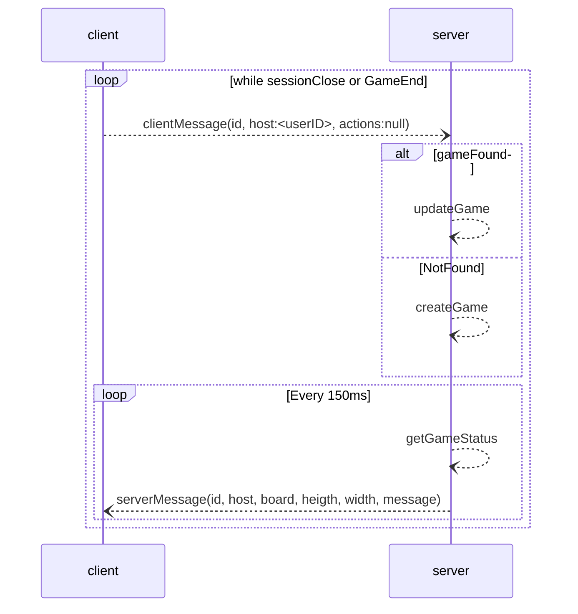

```mermaid
sequenceDiagram

    loop while sessionClose or GameEnd
        client--)server: clientMessage(id, host:<userID>, actions:null)
        alt gameFound
            server--)server: updateGame
        else NotFound
            server--)server:createGame
        end
        loop Every 150ms
            server--)server:getGameStatus
            server--)client: serverMessage(id, host, board, heigth, width, message)
        end
    end
```
