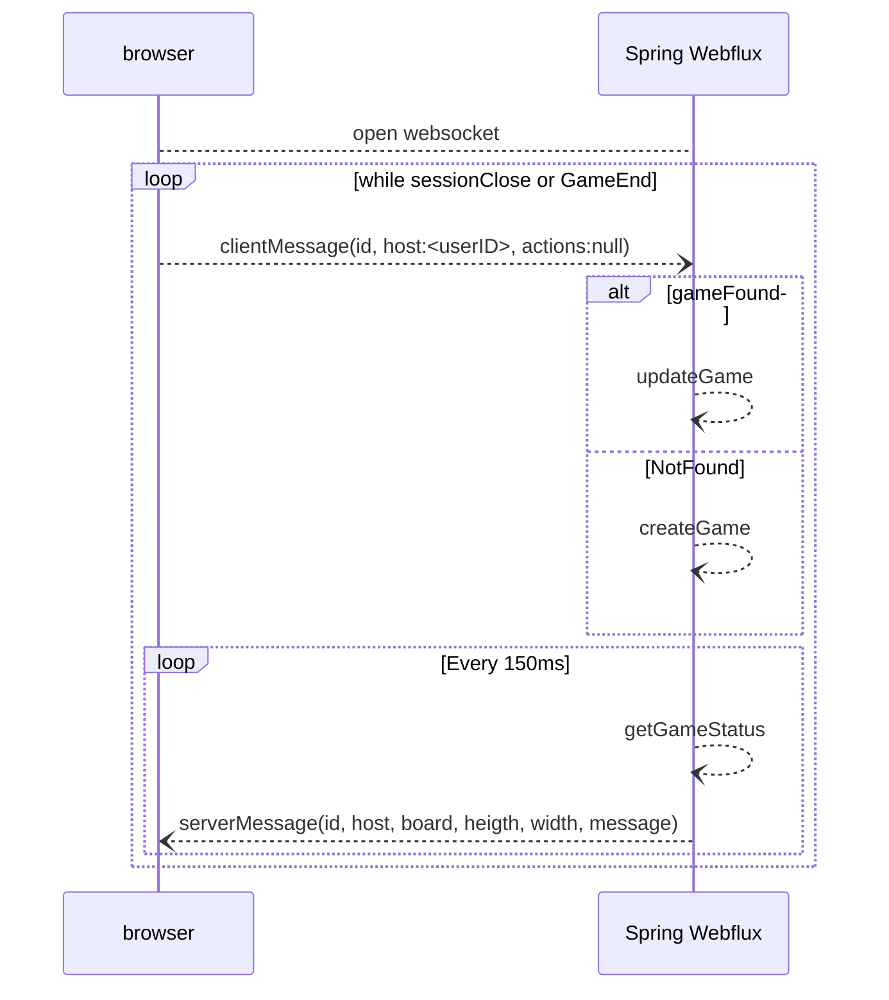

# 지뢰찾기

+ Spring Webflux의 Websocket을 활용한 지뢰찾기 게임  
+ GameID : 비어있거나 해당 값에 대응하는 게임이 없으면 새 게임 생성, 게임이 있으면 참가.  
+ attenders : 커서를 올리면 게임에 참가한 인원을 표시함  
+ flagmode : 텍스트 옆 체크박스 활성화시 깃발꽃기 모드 활성화    숫자를 누르면 숫자 주위에 해당하는 숫자만큼 깃발이 있으면 깃발을 제외한 모든 주위의 버튼을 누릅니다.

## 환경

### redis stack  
https://github.com/redis-stack/redis-stack
#### docker
https://www.docker.com/
#### springboot 3.x  
#### ubuntu 20.04
#### redis-om-spring  
https://github.com/redis/redis-om-spring
## 흐름도

### ServerMessage
서버로 부터 받는 메시지  
+ id : String : 게임 ID  
+ host : String : 게임을 만든 유저 ID  
+ height : int :게임 보드 높이  
+ width : int :게임 보드 넓이  
+ board : int[] :게임 보드 값  
+ message : String :추가 정보를 위한 메시지  
+ attendders : list : 게임에 참가중인 유저들  
### ClientMessage
브라우저에서 서버로 보내는 메시지
+ id : String : 게임 ID  
+ host : String : 메시지를 보내는 유저 ID
+ actions : list<Action> : 유저의 입력값  
    + action
        + loc : int : 유저가 누른 게임보드 인덱스
        + actionType : enum(DIG,FLAG) : 유저의 입력 타입, 깃발꽂기와 파기가 있다
